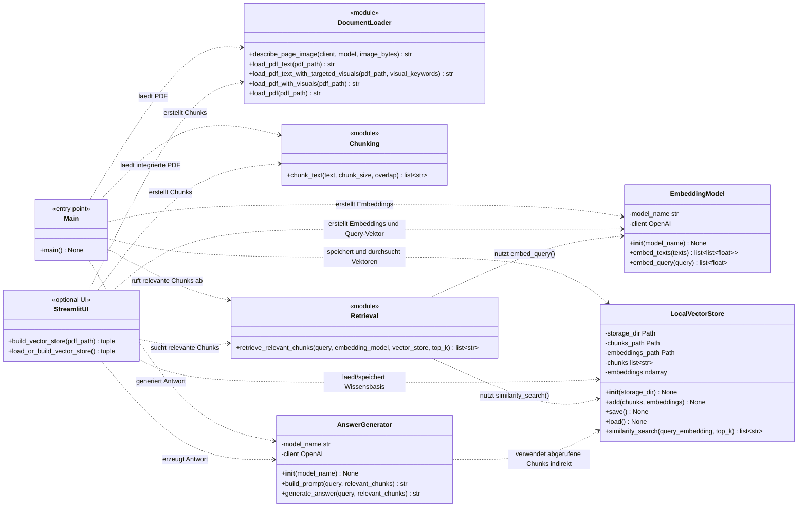
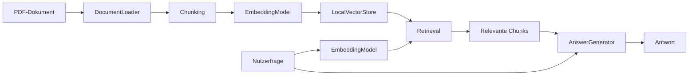

# Klassendiagramm: Standard-RAG-System

Dieses Diagramm zeigt die Struktur des Standard-RAG-Projekts. Einige Dateien enthalten keine Klassen, sondern Funktionen. Diese Module werden im Diagramm als Utility-Komponenten dargestellt, damit die Gesamtarchitektur sichtbar bleibt.

## Kurzbeschreibung der Struktur

- `main.py` ist der Einstiegspunkt der Konsolenanwendung.
- `document_loader.py` laedt die PDF-Datei und wandelt Inhalte in Text um.
- `chunking.py` teilt den Dokumenttext in kleinere Chunks.
- `embeddings.py` enthaelt die Klasse `EmbeddingModel`, die Chunks und Nutzerfragen in Vektoren umwandelt.
- `vector_store.py` enthaelt die Klasse `LocalVectorStore`, die Chunks und Embeddings lokal speichert und semantische Aehnlichkeitssuche ausfuehrt.
- `retrieval.py` verbindet Anfrage-Embedding und Vektordatenbank.
- `generation.py` enthaelt die Klasse `AnswerGenerator`, die aus Frage und Chunks einen Prompt baut und die Antwort generiert.
- `ui.py` ist die optionale Streamlit-Oberflaeche und gehoert nicht zur fachlichen Standard-RAG-Kernlogik.

## Pipeline-Sicht

